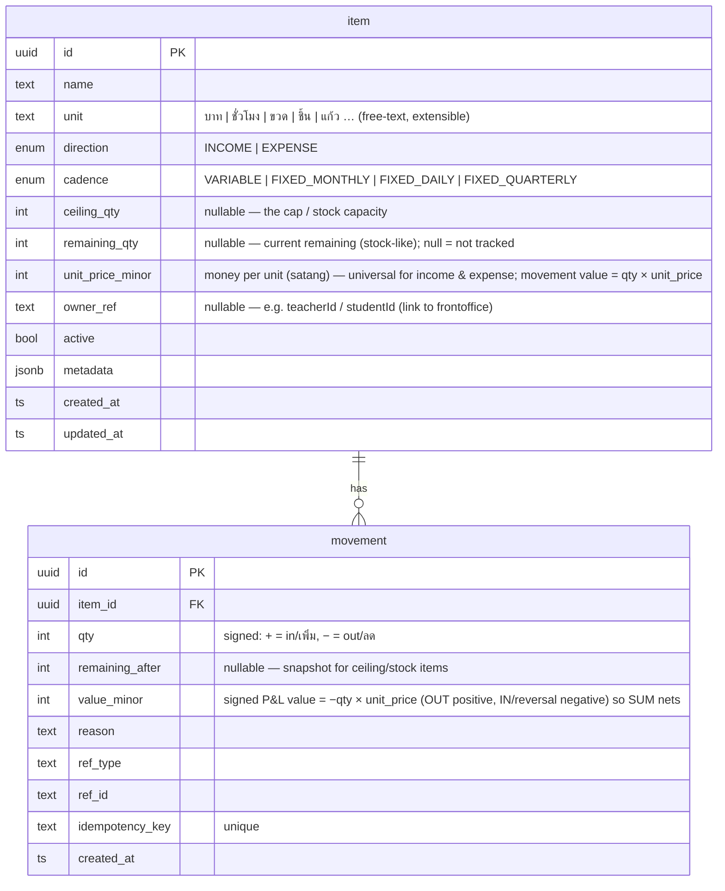

# DB Design — Backoffice rebuild on a universal "item" model (REQ-006, DESIGN-FIRST)
- Author: Sober (SA). For: คุณฟีน (stakeholder) review, via Porter. Date: 2026-07-20.
- **Status: APPROVED by คุณฟีน (rev. 3) — building.**
- **Rev. 3 (2026-07-20)** — คุณฟีน **removed the approval system**: NO OWNER/STAFF roles, NO `approval_request`,
  no role-gating — **every action is direct**, single backoffice admin login (REQ-002-style JWT). Model is
  now **5 tables**.
- **Rev. 2 (2026-07-20)** — incorporated the 5 answers: grouping via **badge-tags** (not `organizations`);
  **free-text units now → managed later**; **income & expense symmetric** (unit_price + stock-as-ceiling);
  **freelance example unit = hour**. *(Rev.2 also added roles+approvals — since REMOVED in rev.3.)*

---

## สรุปสำหรับผู้บริหาร (Thai TL;DR)
- ระบบหลังบ้านตอนนี้มี **15 ตาราง (ใช้จริง 10 / ตายแล้ว 5)** + 11 enum และมี **4 กลไกที่ทำเรื่องเดียวกัน**
  (สต๊อก / กระเป๋าเงิน / ค่าใช้จ่ายรายเดือน / เพดานราคา) — ซับซ้อนเกินและโมเดลผิดตามที่คุณฟีนรู้สึก.
- ข้อเสนอ: **แกนหลัก 2 ตาราง** — **`item`** (ทุกอย่างคือ item มีหน่วย + 2 แกน: รายรับ/รายจ่าย × คงที่/ไม่คงที่ +
  เพดาน/คงเหลือแบบสต๊อก **สำหรับทั้งรายรับและรายจ่ายเหมือนกัน**) และ **`movement`** (เพิ่ม/ลด ผ่าน API).
- ตามที่คุณฟีนสั่ง: จัดกลุ่ม item ด้วย **ระบบแท็ก/ป้าย** (แบบ badge หน้าบ้าน ไม่ใช่ organizations) ·
  หน่วยพิมพ์เองก่อน ค่อยทำ dropdown ทีหลัง · **ไม่มีระบบอนุมัติ** (rev.3): แอดมินคนเดียว ทำได้ทุกอย่างทันที.
- ใช้ **ฐานข้อมูลเดียวกับหน้าบ้าน** → หน้าบ้านตัดเพดานครูได้ **ใน transaction เดียวกับการจอง (atomic)** ไม่ต้องยิง HTTP.
- **เพดานครูฟรีแลนซ์ = item ตัวอย่างแรก หน่วย = ชั่วโมง** (เพดาน 80/80 ชม., เรท = ราคา/หน่วย), ย้ายจาก REQ-004 เข้าได้ 1:1.
- รวมแล้วเหลือ **~5 ตาราง** (จาก 15) — กลไกเงินเหลือ **แบบเดียว** (item+movement) แทน 4 แบบเดิม.
- **ยังไม่สร้าง** — รออนุมัติดีไซน์ก่อน.

---

## 1. Current as-built (the real single-DB picture today)
One PostgreSQL, two schemas. Frontoffice owns `public.*`; the backoffice owns `ops.*`.

### 1a. `public.*` — frontoffice / scheduling (16 tables, 4 enums)
The scheduling domain (not being rebuilt). Groups:
- **People:** `parents`, `students`, `teachers`, `subjects`, `teacher_subjects`.
- **Entitlements/booking:** `course_packages`, `vouchers`, `bookings` (central), `badge_types` / `badge_values` / `booking_badges`.
- **Money bridge:** **`freelance_budgets`** (per-freelance monthly cap — *just re-homed here by REQ-004*).
- **Infra:** `app_settings` (KV), `job_runs` (job audit), `line_link_sessions`, `notification_outbox`.
- Note: `bookings.incoming_booking_id / pending_slot / reschedule_to` are legacy (dead B.1 reschedule flow).

### 1b. `ops.*` — the backoffice being rebuilt (15 tables, 11 enums)
**Live (10):** `organizations`, `parties`, `catalog_items`, `stock_balances`, `stock_movements`,
`accounts`, `account_ledger`, `commercial_requests`, `price_rules`, `recurring_costs`.
**Dead scaffolding (5 — schema-only, zero code):** `settlement_runs`, `settlement_lines`,
`api_credentials`, `idempotency_records`, `notification_outbox` (+ their 3 unused enums).

The live money model = **four parallel mechanisms for one idea ("a thing with a balance that goes in/out"):**
| Mechanism | Tables | "Thing" | "Movement" | Balance |
|-----------|--------|---------|-----------|---------|
| Stock | `catalog_items` + `stock_balances` + `stock_movements` | item (SKU) | IN/OUT/ADJUST + `amount_minor` | `stock_balances.quantity_on_hand` |
| Wallet | `accounts` + `account_ledger` | account (per party+unit) | CREDIT/DEBIT | `accounts.balance_minor` |
| Recurring | `recurring_costs` (+ a FIXED_COST item) | effective-dated salary | monthly materialize movement | — |
| Pricing/cap | `price_rules` (HOURLY/FIXED/PERCENTAGE/CAP) | rate/cap rule | — | — |
| Workflow | `commercial_requests` | approval request | status transitions | — |

## 2. Gap analysis — what the current backoffice got wrong / over-built
1. **⅓ of the tables are dead** (5/15 never wired) — speculative scaffolding (settlement, api-keys, idempotency cache, outbox).
2. **Two vocabularies for the same concept.** Stock (`stock_movements`: IN/OUT/ADJUST, `quantity`+`amount_minor`, `quantity_on_hand`) and Wallet (`account_ledger`: CREDIT/DEBIT, `amount_minor`, `balance_minor`) are the **same pattern** — an append-only ledger maintaining a running balance — with different names. A user must learn two models for one idea.
3. **Cadence is jammed into the "type" enum.** `item_type = INCOME | EXPENSE | FIXED_COST`. `FIXED_COST` mixes **direction** (it's an expense) with **cadence** (it's recurring). You *cannot* express a "fixed monthly **income**" (a retainer) cleanly. → The stakeholder's two-axis idea (direction × cadence) is exactly the fix.
4. **A third mechanism for "recurring".** `recurring_costs` (effective-dated) is a whole table + supersede logic for what the cadence axis should express as an item attribute.
5. **A fourth mechanism for "rate/cap".** `price_rules` (4 kinds incl. CAP). A cap is just a **ceiling** attribute on an item; a rate is just a **unit price** already on the item.
6. **A redundant balance table.** `stock_balances` is derivable from movements — an extra table + consistency surface. A single `remaining` column on the item row is enough.
7. **Separate service + separate DB + HTTP.** The backoffice was a separate app reached over HTTP (via `external_ref`), which made the freelance drawdown **non-atomic** and cache-laggy — the very problem REQ-004 had to escape by going local. *(The shared-DB rebuild removes this class of problem entirely.)*

**Net:** 15 tables + 11 enums + 4 overlapping mechanisms → collapses to **2 tables + 2 enums + 1 mechanism.**

## 3. Proposed model — universal `item` + `movement` (shared DB, schema `bo`)
> Everything is an **item** with a **unit**; its quantity **goes in/out** via **movements**. Two axes classify it; an optional **ceiling/remaining** makes it behave like stock.

- **Two core enums:** `direction` (INCOME|EXPENSE) × `cadence` (VARIABLE|FIXED_*). (vs 11 today.)
- **Symmetric income & expense** (คุณฟีน rev.2): both use `unit_price_minor` (money per unit) + optional
  `ceiling_qty`/`remaining_qty` (stock). **`value_minor = −qty × unit_price_minor`** (signed: OUT positive,
  IN/reversal negative) for every movement — one rule, same for income and expense, and `SUM` nets reversals.
- **Ceiling/remaining live on the item row** (no separate balance table); maintained by movements.
- **The 4 old mechanisms collapse into one.** Stock, wallet (hours/points), recurring salary, price/cap are
  all just `item` + `movement`: a student hour-wallet = item(unit=ชม., ceiling/remaining); a salary =
  item(unit=เดือน, EXPENSE, FIXED_MONTHLY, unit_price=amount); a product = item(unit=ขวด, INCOME, ceiling, unit_price).
- **P&L report = one query:** `SUM(value_minor) GROUP BY item.direction (, item.cadence)` (nets reversals via the signed value).

### Grouping via badge-tags (replaces `organizations`) — คุณฟีน rev.2
Reuse the frontoffice badge pattern instead of a rigid org FK — flexible, admin-defined groupings (สาขา / หมวด / …):
- **`tag_group`** (id, name, active, sort_order) — e.g. "สาขา", "หมวดสินค้า".
- **`tag_value`** (id, tag_group_id→tag_group, label, color?, active, sort_order) — e.g. "สาขา A".
- **`item_tag`** (item_id→item, tag_value_id→tag_value, tag_group_id) — PK(item_id, tag_value_id),
  UNIQUE(item_id, tag_group_id) = one value per group per item. (Same shape as `public.booking_badges`.)

### Auth — single admin, no approvals (คุณฟีน rev.3)
- **No roles, no approval flow.** A single backoffice admin logs in (reuse the **REQ-002 JWT** pattern already
  live) and every action is **direct** — no OWNER/STAFF split, no `approval_request`. (Roles/approvals can be
  added later if คุณฟีน asks; the token can carry a role then without a schema change.)

**Table count: ~5** — `item`, `movement`, `tag_group`, `tag_value`, `item_tag` (down from 15), with **one**
money mechanism instead of four. Auth reuses the existing single-admin JWT (no new tables).

## 4. Worked examples
**① Freelance ceiling (the REQ-004 bridge) — unit = ชั่วโมง** — `item{ name:"เพดานครูมาร์ค", unit:"ชั่วโมง",
direction:EXPENSE, cadence:FIXED_MONTHLY, ceiling_qty:80, remaining_qty:80, unit_price_minor:50_000 (฿500/ชม.) }`.
Booking a 1-hour job → `movement{ qty:−1, remaining_after:79, value_minor:50_000, ref_type:"BOOKING", ref_id:<id> }`
→ **remaining 79 / 80 ชม.** (= ฿39,500 of ฿40,000 drawn). Cancel → `qty:+1`. Month start → `remaining_qty =
ceiling_qty`. **The frontoffice writes this movement in the booking's own DB transaction (same DB) → atomic**,
exactly the REQ-004 behavior, now inside the universal model. `public.freelance_budgets` maps **1:1**
(budget→ceiling in hours, `rate_minor`→`unit_price_minor`, `remaining`→`remaining_qty`).

**② Product with stock (water bottles) — unit = ขวด** — `item{ name:"น้ำเปล่า", unit:"ขวด", direction:INCOME,
cadence:VARIABLE, ceiling_qty:100, remaining_qty:100, unit_price_minor:1500 }`. Sell 2 →
`movement{ qty:−2, remaining_after:98, value_minor:3000 }`. One movement = stock-out **and** ฿30 revenue —
same shape as ① but `direction:INCOME` (the symmetry คุณฟีน asked for).

**③ Fixed monthly cost (rent) — unit = เดือน** — `item{ name:"ค่าเช่า", unit:"เดือน", direction:EXPENSE,
cadence:FIXED_MONTHLY, ceiling_qty:null, unit_price_minor:3_000_000 (฿30,000/เดือน) }`. A monthly job posts
`movement{ qty:−1, value_minor:3_000_000 }` → P&L expense ฿30,000. No ceiling (recurring cost, not stock).

## 5. How the frontoffice interacts (the shared-DB advantage)
Because the backoffice now lives in the **same PostgreSQL** (schema `bo` alongside `public`), the frontoffice
reaches items **two ways**:
- **Direct same-DB, in-transaction** for the hot/atomic path — e.g. decrement a freelance ceiling **in the
  booking's transaction**. No HTTP, atomic, no cache lag. *(This is what the old separate-service model
  couldn't do, and why REQ-004 had to pull the cap local — the shared DB makes universal-model + atomic
  enforcement compatible.)*
- **Backoffice API** for admin CRUD + reporting (create/edit items, adjust movements, P&L) and future clients.
- **Ownership:** the `bo` schema is owned by the (rebuilt) backoffice; the frontoffice has read + a narrow
  movement-write grant. One DB, clear boundary, no cross-DB/external_ref plumbing.

## 6. Migration path (AFTER approval — future REQs, not built now)
- `ops.catalog_items` → `bo.item` (`item_type` FIXED_COST → direction EXPENSE + cadence FIXED_MONTHLY;
  INCOME/EXPENSE → direction, cadence VARIABLE; `sale_price_minor`→`unit_price_minor`; `reorder_level`→a
  near-cap in `metadata`).
- `ops.stock_balances.quantity_on_hand` → `item.remaining_qty` (drop the table);
  `ops.stock_movements` → `bo.movement` (direction+quantity → signed `qty`; `amount_minor` → `value_minor`).
- `ops.accounts`/`account_ledger` → items (unit=HOURS/POINTS/บาท) + movements.
- `ops.recurring_costs` → FIXED_MONTHLY items (a monthly job posts the movement; rate change = future movements).
- `ops.price_rules` → item `unit_price` + `ceiling`; drop. Drop the 5 dead tables.
- `ops.commercial_requests` → **dropped** (no approvals, rev.3); `ops.parties`/`organizations` → **not carried
  over** (a counterparty is a frontoffice entity referenced by `item.owner_ref`; groupings move to **tags**;
  auth stays the single-admin JWT).
- `public.freelance_budgets` → `bo.item` **unit=ชั่วโมง** (example ①: `monthly_budget`→`ceiling_qty` in hours,
  `rate_minor`→`unit_price_minor`, `remaining_minor`→`remaining_qty`); frontoffice keeps writing decrements in-tx.

## 7. Decisions (APPROVED, rev. 3) + build plan
คุณฟีน's decisions, all folded in:
1. **Grouping → badge-tags** (not `organizations`) — §3 "Grouping via badge-tags".
2. **NO approvals / NO roles (rev.3)** — single-admin JWT, every action direct — §3 "Auth".
3. **Units:** free-text now → managed dropdown later.
4. **Income & expense symmetric** — both via `unit_price` + stock-as-ceiling; `value = qty × unit_price` (§3, §4).
5. **Freelance ceiling = unit ชั่วโมง** — §4①.

**Approved → building (SPEC-006).** Task streams:
- (a) **`bo` schema + migration** — item, movement, tag_group, tag_value, item_tag (owned by the rebuilt
  backoffice-back; same PostgreSQL).
- (b) **Backoffice API + admin UI** — items/movements/tags CRUD + P&L report; reuse the single-admin JWT (no roles).
- (c) **Frontoffice in-tx integration** — the freelance ceiling becomes a `bo.item` (unit=hour), decremented in
  the booking's own transaction (re-absorbs REQ-004; retires `public.freelance_budgets`).
- (d) **Data migration** — `ops.*` (live tables) + `public.freelance_budgets` → `bo.*`; old ops tables left dormant.
